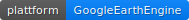
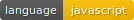
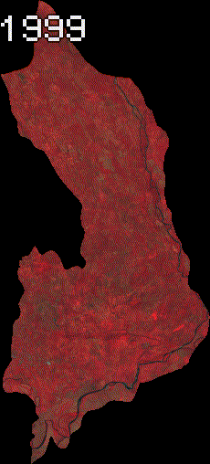

# ts_landsat_hidroelectrica
Generation of an animation gif with landsat images

 

  

## Installation
The code is to be executed in the code editor of Google Earth Engine.
Nothing needs to be installed. You only have a gmail account.
More information regarding Google Earth Engine: 
https://developers.google.com/earth-engine 

## Usage

### Explanation of the code

## Support
Support is welcomed. I also can give you support in case bugs arise. Just write an E-Mail, or raise the issue on GitLab.

## Contributing
Fork the repository if you need to develop some other functionalities, or modify the already implemented. 
In case you want to make a push request into master, just contact me, or make the push request.. I'll notice
that. 

## Authors and acknowledgment
Roger Almengor González (developer and mantainer)
E-Mail: rogeralmengor@gmail.com 
E-Mail2: thebeautyofthepixel@gmail.com
E-Mail3: almrog16@gmail.com

## License
MIT

## Project status
Generates Time Series of Lansat 7 Imagery. 2do: Temperature Analysis